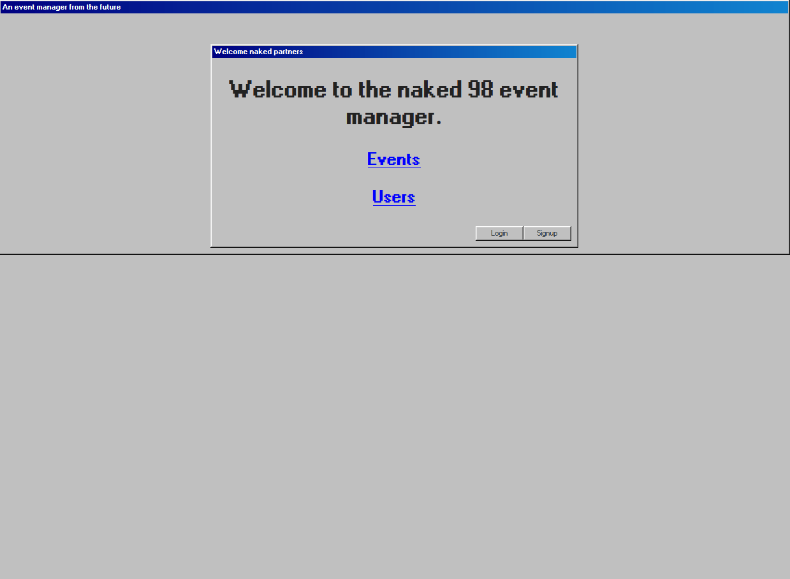

# Associations


<br />
<p align="center">
  <a href="https://github.com/Bismarck-GM/microverse-associations">
    
  </a>

  <h3 align="center">Event Manager</h3>

  <p align="center">
    In this project, we build an application named Private Events that behaves similar to Eventbrite. Using the main concepts of Associations of Rails.
    <br />
    <br />
    <a href="https://github.com/Bismarck-GM/microverse-associations/issues">Report Bug</a>
    ·
    <a href="https://github.com/Bismarck-GM/microverse-associations/issues">Request Feature</a>
  </p>
</p>



## Built With

- Ruby On Rails
- VSCode/Neovim
- Rubocop
- Sticker
- Github Actions
- Postgresql

## Live Demo

[Live Demo Link](https://members-club.upperdown.me)


<!-- INSTALLATION -->
## Usage

To have this app on your pc, you need to:
* have Ruby & Ruby on Rails installed in your computer
* [download](https://github.com/Bismarck-GM/microverse-associations/archive/development.zip) or clone this repo:
  - Clone with SSH:
  ```
    git@github.com:Bismarck-GM/microverse-associations.git
  ```
  - Clone with HTTPS
  ```
    https://github.com/Bismarck-GM/microverse-associations.git
  ```
* and open the terminal inside the repo and run the bundler
  - ```$ bundler install --without production```
* then, run rails db:migrate. This creates the database with the corresponding tables, columns and associations
  - ```$ rails db:migrate```
* then, run rails s. This will start the server at localhost `http://127.0.0.1:3000/`
  - ```$ rails s```
* and finally, you can test it in the console by running
  - ```$ rails console --sandbox```

<!-- AUTOMATED TEST -->
### Automated Test

We use RSpec and Capybara to perform tests.

To run them just go to the root folder and use ```rspec```

## Authors

👤 **Hasan Kharouf**

- Github: [@wintercore](https://github.com/wintercore)

👤 **Gerónimo Morisot**

- Github: [@Bismarck-GM](https://github.com/Bismarck-GM)
- Twitter: [@Rewritablee](https://twitter.com/Rewritablee)
- Linkedin: [geronimomorisot](https://linkedin.com/in/geronimomorisot)

## 🤝 Contributing

Contributions, issues and feature requests are welcome!

Feel free to check the [issues page](issues/).

## Show your support

Give a ⭐️ if you like this project!

## Acknowledgments

- Microverse

## 📝 License

This project is [MIT](lic.url) licensed.